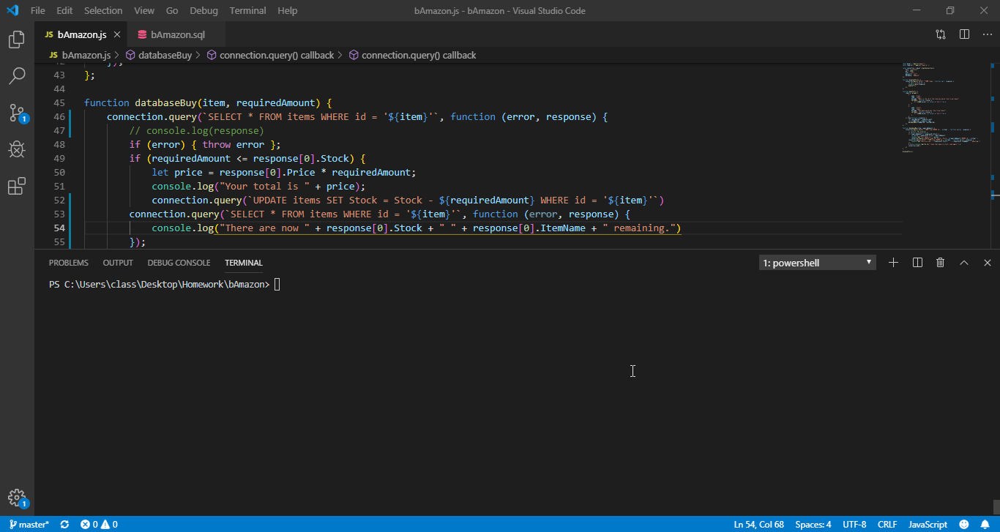
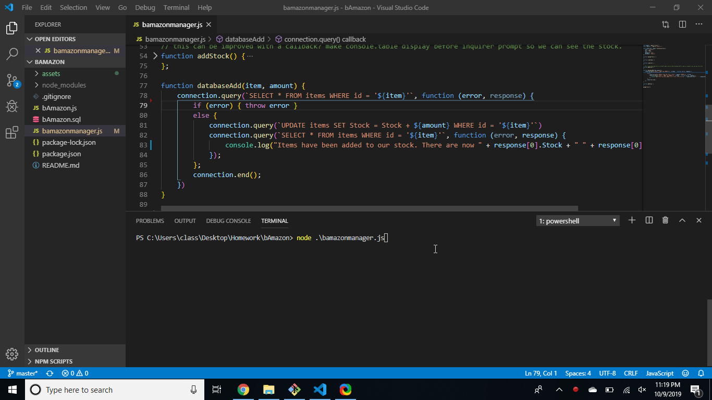
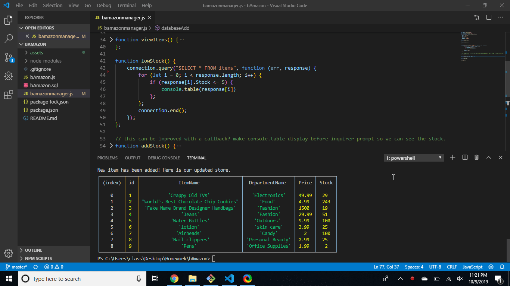
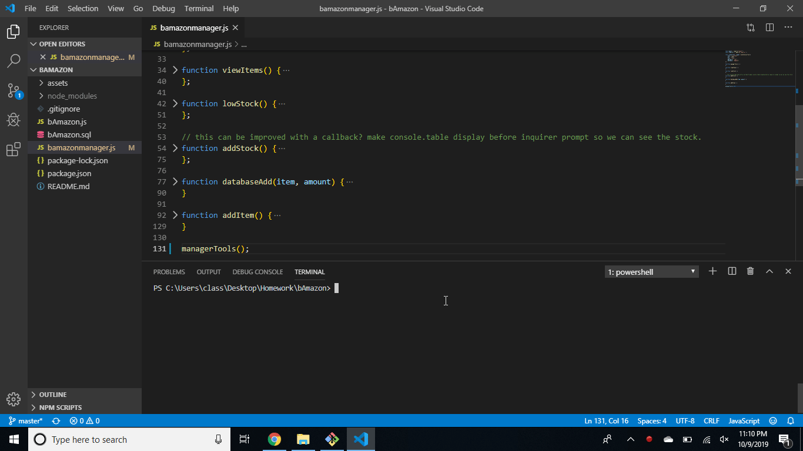

# bAmazon Customer and Manager

## Node.js + MySQL
In this assignment, I will be creating a storefront with MySQL. 

## Customer Overview
On the customer end, the store will ask what item a customer wants, and subtracts the amount from the total stock, if the stock permits. If not, the store will not take the order, and you will have to start over.

#### Below is a quick demo of how the customer's store works

### Faults and Future Development

1. At the moment, you are not able to tell the store which item you want to purchase by the name, so you will have to enter an id. 
2. You are able to enter a number that is beyond the max id listed, but will get errors.
3. Would like to implement a way to prevent this from happening. Perhaps an inquirer and for loop which then shows a list of ids to select from. However, this will not be practical with a huge store.

## Manager Overview
On the manager side, the manager will be prompted several different actions to choose from. From the prompt you are able to view the store, add items to the store, update stock, or have stock with low items (<5) listed to you!
#### Below is a quick demo of how each of the manager's capabilties work
1. Displaying the store and restocking items

2. Grabbing the information of low stock items

3. Adding new items to the store

### Faults and Future Development
1. Similar to the customer side, you aren't able to tell the store which item you want to modify. It will only take an id input, which again, can still be beyond the highest number shown.
2. Displaying the table before choosing what item to add stock to would be a nice quality of life improvement. Maybe this can be done with callbacks.

# Final Thoughts
Although this assignment was not that difficult, it really helps to develop our skills with Node.js, Javascript, and MySQL. Despite both activities being similar, and using very similar code, using it multiple times and being WET helps me as a student familiarize myself better with the concepts. 
